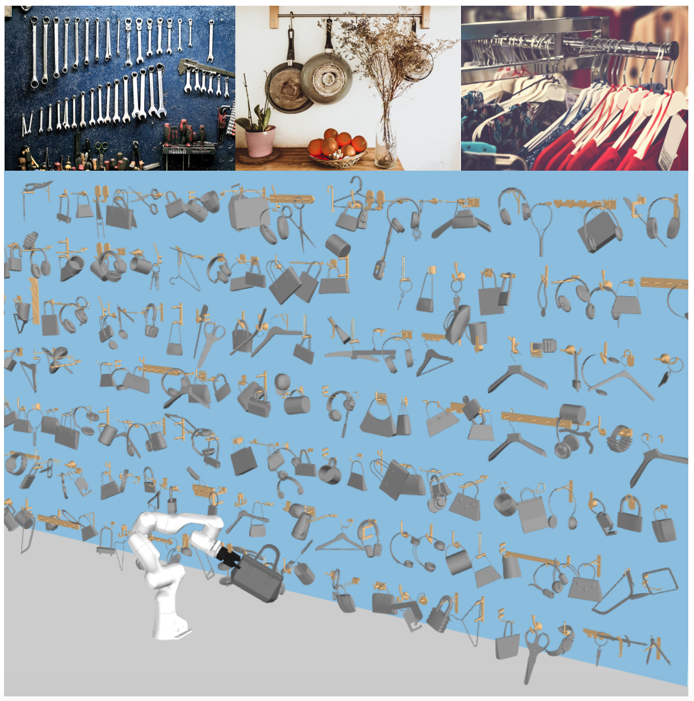

# Generative 3D Part Assembly via Dynamic Graph Learning

This is the implementation of ICRA 2021 paper "OmniHang: Learning to Hang Arbitrary Objects using Contact Point Correspondences and Neural Collision Estimation" created by 
Yifan You*, <a href="https://linsats.github.io/" target="_blank">Lin Shao*</a>, Toki Migimatsu, and <a href="https://web.stanford.edu/~bohg/" target="_blank">Jeannette Bohg</a>.



Hanging objects is a common daily task. Our system helps robots learn to hang arbitrary objects onto a diverse set of supporting items such as racks and hooks. All hanging poses rendered here are outputs of our proposed pipeline on object-supporting item pairs unseen during training.

- [paper link](https://arxiv.org/pdf/2103.14283.pdf)
- [project page](https://sites.google.com/view/hangingobject/)


## File Structure

This repository provides data and code as follows.


```
    data/                       # contains all data. Details explained in Dataset Structure section
        
    src/    
        scripts/                        # contains code used to generate data
                ...
                collect_pose_data_vary_scale.py # generates hanging poses
                generate_takeoff_v2.py          # checks if an object in the hanging pose can be taken off
                generate_cp_acc_soft.py         # generates soft contact points, given hanging poses
                generate_partial_pc_soft.py     # generates partial point clouds, given soft contact points

    	utils/					    # something useful

    	lin_my/	                    # training/evaluation 
            runs/                   # contains pretrained models, also where models/tensorboards/debugging info are saved during training/evaluation

            pointnet4/              # code adapted from PointNet++ (https://github.com/charlesq34/pointnet2)
            ...
            simple_dataset.py       # simple dataset that loads supporting items, objects, and successful hanging poses
            hang_dataset.py         # dataset that loads supporting items, objects, successful hanging poses,
                                    # contact points, and contact point correspondences
            ...
            s1_train_matching.py    # stage 1 training/evaluation
            s2a_train.py            # stage 2a training/evaluation
            s2b_train_discrete.py   # stage 2b training/evaluation
            s3_rl_collect.py        # stage 3 online data collection. also used for stage 3 evaluation
            s3_rl_train.py          # stage 3 online training


```
This code has been tested on Ubuntu 16.04 with Cuda 9.0, Python 3.6, and TensorFlow 1.12.

## Dataset Structure
The dataset is organized as follows.

```
    data/
        ...
        geo_data/                   # urdfs/meshes for objects and supporting items
        geo_data_partial_cp_pad/    # partial point clouds for objects and supporting items
        collection_result/          # successful hanging pose
        collection_result_more/     # more successful hanging pose
        collection_result_neg/      # unsuccessful hanging pose
        collection_result_pene_big_neg_new # object poses w/o collision
        collection_result_pene_big_pos_new # object poses w/ collision
        dataset_cp/                 # contact points and contact point correspondences for poses in collection_result/
        dataset_cp_more/            # contact points and contact point correspondences for poses in collection_result_more/

```

## Dependencies

This repo requires building PointNet++(https://github.com/charlesq34/pointnet2) in `src/lin_my/pointnet4/`. Please refer to PointNet++'s repo for building instructions.

## Downloading Dataset and Pretrained Models


## Questions

Please post issues for questions and more helps on this Github repo page. We encourage using Github issues instead of sending us emails since your questions may benefit others.

## Maintainers
@yifan-you-37 
@linsats


## Citation

  <!-- @InProceedings{HuangZhan2020PartAssembly,
      author = {Huang, Jialei and Zhan, Guanqi and Fan, Qingnan and Mo, Kaichun and Shao, Lin and Chen, Baoquan and Guibas, Leonidas and Dong, Hao},
      title = {Generative 3D Part Assembly via Dynamic Graph Learning},
      booktitle = {The IEEE Conference on Neural Information Processing Systems (NeurIPS)},
      year = {2020}
  } -->
    @misc{you2021omnihang,
      title={OmniHang: Learning to Hang Arbitrary Objects using Contact Point Correspondences and Neural Collision Estimation}, 
      author={Yifan You and Lin Shao and Toki Migimatsu and Jeannette Bohg},
      year={2021},
      eprint={2103.14283},
      archivePrefix={arXiv},
      primaryClass={cs.RO}
    }

## License

MIT License

## Todos

Please request in Github Issue for more code to release.
